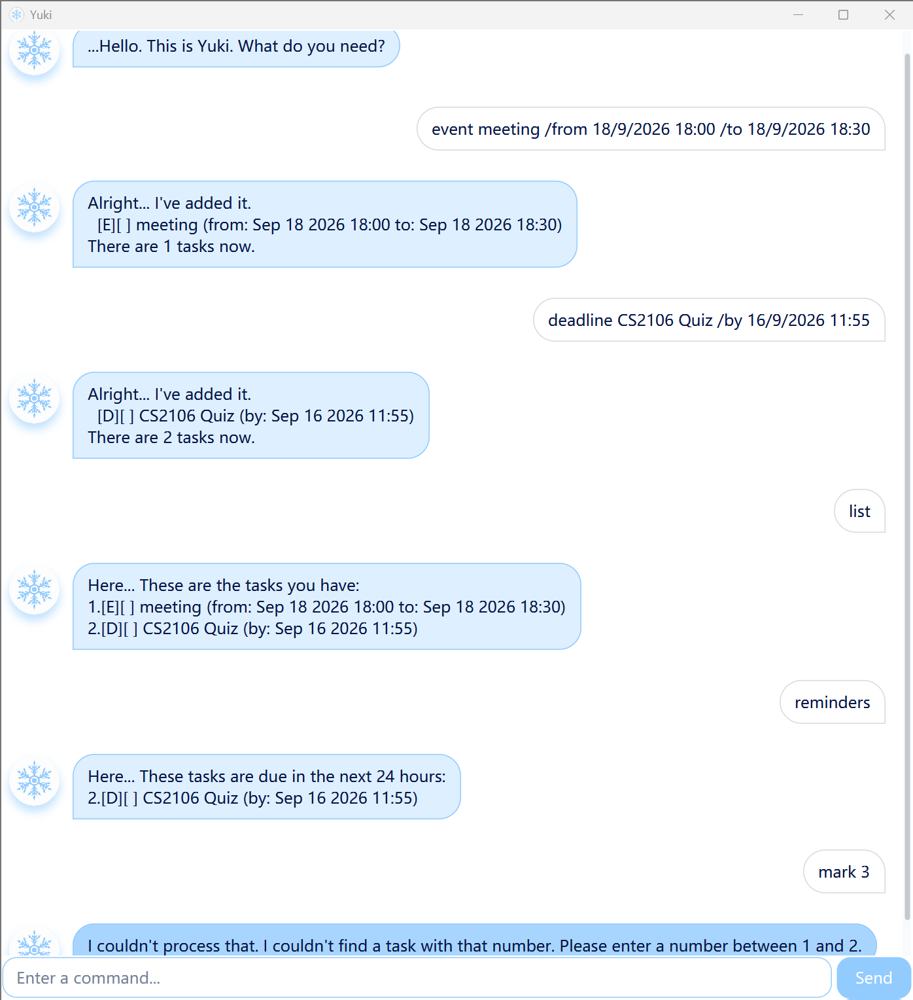

# Yuki User Guide

Yuki is a desktop task manager for people who prefer typing short commands. It keeps to-dos,
deadlines, and events in one list, saves changes automatically, and highlights tasks due within the
next 24 hours.



## Quick start

1. Install [Java 25](https://www.oracle.com/java/technologies/downloads/).
2. Download `yuki.jar` from the project's
   [Releases page](https://github.com/IMNOTANNIE/ip/releases) and place it in a folder of your choice.
3. Open a terminal in that folder and run:

   ```shell
   java -jar yuki.jar
   ```

4. Type a command into the box and press <kbd>Enter</kbd> or click **Send**.

Yuki creates `data/userdata.txt` in the folder from which it is run and saves every change there
automatically.

> [!TIP]
> Enter `list` at any time to see your task numbers and current task status.

## Command format

- Use command words and parameters in lowercase exactly as shown.
- Replace words in `UPPER_CASE` with your own values. Do not type the underscores.
- Extra spaces before, after, or between command parts are ignored.
- Use a task's number from `list` with `mark`, `unmark`, and `delete`.

Dates can be entered as `d/M/yyyy`, `d/M/yyyy HHmm`, or `d/M/yyyy HH:mm`.
For example, `6/8/2026`, `6/8/2026 1800`, and `6/8/2026 18:00` are valid. You can also enter free
text such as `Friday`, but Yuki cannot include it in reminders. When this happens, Yuki adds the
task and displays a warning.

## Features

### Adding a to-do: `todo`

Adds a task without a date.

Format: `todo DESCRIPTION`

Example: `todo read a book`

### Adding a deadline: `deadline`

Adds a task that must be completed by a date or time.

Format: `deadline DESCRIPTION /by DATE`

Example: `deadline submit report /by 26/8/2026 1800`

Use `/by` exactly once and place it between the description and date.

### Adding an event: `event`

Adds an activity with a start and an end.

Format: `event DESCRIPTION /from START /to END`

Example: `event project meeting /from 26/8/2026 1800 /to 26/8/2026 2000`

Use `/from` and `/to` exactly once and in that order. When both values are supported dates, they
must either both include a time or both omit it, and the end must be later than the start.

### Viewing all tasks: `list`

Shows every task in the order it was added.

Format: `list`

The symbols identify each task:

- `[T]` — to-do
- `[D]` — deadline
- `[E]` — event
- `[X]` — completed; `[ ]` — not completed

### Finding tasks: `find`

Shows tasks whose descriptions contain the keyword or phrase. Matching is not case-sensitive.

Format: `find KEYWORD`

Example: `find report`

> [!NOTE]
> Numbers in the search results indicate the result order. Use `list` to find the task number needed
> by `mark`, `unmark`, or `delete`.

### Viewing upcoming tasks: `reminders`

Shows incomplete deadlines and events due from the current minute through the next 24 hours. Yuki
also displays this list automatically when it starts, but stays quiet when nothing is due soon.

Format: `reminders`

Deadlines use their due date, while events use their start date. A date without a time is treated as
23:59 on that date. If the date used for reminders is not in a supported format, Yuki saves the task
as entered but warns that it will not appear in reminders. To-dos and completed tasks are not
included. The displayed task numbers are the same as those shown by `list`.

### Marking a task as completed: `mark`

Format: `mark TASK_NUMBER`

Example: `mark 2`

### Marking a task as not completed: `unmark`

Format: `unmark TASK_NUMBER`

Example: `unmark 2`

### Deleting a task: `delete`

Permanently removes a task from the list.

Format: `delete TASK_NUMBER`

Example: `delete 2`

### Exiting Yuki: `bye`

Ends a command-line session. In the desktop window, close Yuki using the window's close button. Your
latest changes have already been saved.

Format: `bye`

## Command summary

| Action | Command |
| --- | --- |
| Add a to-do | `todo DESCRIPTION` |
| Add a deadline | `deadline DESCRIPTION /by DATE` |
| Add an event | `event DESCRIPTION /from START /to END` |
| View all tasks | `list` |
| Find tasks | `find KEYWORD` |
| View tasks due soon | `reminders` |
| Mark a task completed | `mark TASK_NUMBER` |
| Mark a task not completed | `unmark TASK_NUMBER` |
| Delete a task | `delete TASK_NUMBER` |
| Exit Yuki | `bye` |

## If something goes wrong

Yuki explains invalid commands without closing, so you can correct the command and try again. It
also rejects duplicate tasks and task numbers that are not in the list.

If `data/userdata.txt` is missing, Yuki starts with an empty list and creates the file when it first
saves a task. If the file cannot be read or contains invalid data, Yuki reports the problem and
blocks changes to protect the existing file. Repair or move the file, then restart Yuki.

## AI assistance

The project author used OpenAI Codex to identify potential issues in the code and to help implement
some methods and unit tests.
